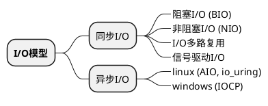
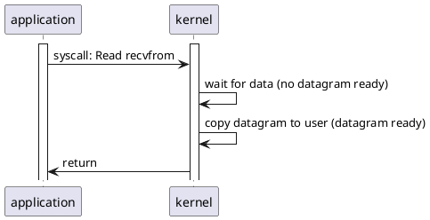

---
title: rust async
date: 2023-01-13 17:17:10
tags:
--- [rust]

## I/O
I/O：在计算机中指Input/Output。由于程序和运行时数据是在内存中驻留，由cpu来执行，涉及到数据交换的地方，通常是磁盘、网卡等，就需要IO接口


### I/O 模型

#### 同步阻塞
- 当用户线程发起IO请求后，会进行系统调用（system call）来让内核（Kernel）进行IO操作（系统调用是用户空间和内核空间的一个通道）；
- 此时用户线程阻塞，等待内核将数据准备好；
- 内核将数据准备好后会将数据从内核空间拷贝到用户空间，并返回给用户线程结束阻塞。

#### 同步非阻塞
- 由用户线程发起IO请求，进行系统调用来让内核进行IO操作；
- 此时如果内核没有准备好数据则会直接返回error，并不会阻塞用户线程，用户线程可以重复发起IO请求；
- 当用户线程发起请求并且内核已经将数据准备好后，会将数据从内核空间拷贝到用户空间（这个过程是需要阻塞用户线程的），返回给用户。

#### 同步多路复用
- 用户线程调用select后进行系统调用（内核会监视所有select负责的socket）
- 当用户将数据准备好后就会返回，并通知用户线程进行读取操作，此时内核将数据拷贝到用户空间并返回。此时用户线程被阻塞；

#### 异步I/O
- 用户线程进行aio_read，进行系统调用切换到内核；
- 内核立即返回，并不会阻塞用户线程；
- 内核准备好数据后会将数据从内核空间拷贝到用户空间并通知用户线程（发送信号）操作已完成。

### 流程图
#### 同步blocking I/O



#### I/O多路复用

### 异步编程


## the Future Trait
A Future is an asynchronous computation that can produce a value. A simplified version of the future trait might look something like this

```rust

trait SimpleFuture {
    type Output;
    fn poll(&mut self, wake: fn()) -> Poll<Self::Output>;
}

enum Poll<T> {
    Ready(T),
    Pending,
}
```

For example, consider the case where we want to read from a socket that may or may not have data available already.
```rust
pub struct SocketRead<'a> {
    socket: &'a Socket,
}

impl SimpleFuture for SocketRead<'_> {
    type Output = Vec<u8>;

    fn poll(&mut self, wake: fn()) -> Poll<Self::Output> {
        if self.socket.has_data_to_read() {
            // The socket has data -- read it into a buffer and return it.
            Poll::Ready(self.socket.read_buf())
        } else {
            // The socket does not yet have data.
            //
            // Arrange for `wake` to be called once data is available.
            // When data becomes available, `wake` will be called, and the
            // user of this `Future` will know to call `poll` again and
            // receive data.
            self.socket.set_readable_callback(wake);
            Poll::Pending
        }
    }
}

```

 the real Future trait and how it is different
```rust
trait Future {
    type Output;
    fn poll(
        // Note the change from `&mut self` to `Pin<&mut Self>`:
        self: Pin<&mut Self>,
        // and the change from `wake: fn()` to `cx: &mut Context<'_>`:
        cx: &mut Context<'_>,
    ) -> Poll<Self::Output>;
}

```
The first change you'll notice is that our self type is no longer &mut Self, but has changed to Pin<&mut Self>. We'll talk more about pinning in a later section, but for now know that it allows us to create futures that are immovable. Immovable objects can store pointers between their fields, e.g. struct MyFut { a: i32, ptr_to_a: *const i32 }. Pinning is necessary to enable async/await.

Secondly, wake: fn() has changed to &mut Context<'_>. In SimpleFuture, we used a call to a function pointer (fn()) to tell the future executor that the future in question should be polled. However, since fn() is just a function pointer, it can't store any data about which Future called wake.

In a real-world scenario, a complex application like a web server may have thousands of different connections whose wakeups should all be managed separately. The Context type solves this by providing access to a value of type Waker, which can be used to wake up a specific task.


## task wakeups with Waker
Waker provides a wake() method that can be used to tell the executor that the associated task should be awoken. When wake() is called, the executor knows that the task associated with the Waker is ready to make progress, and its future should be polled again.

## referencs
[csdn blog](https://blog.csdn.net/XMJYever/article/details/111560976)
